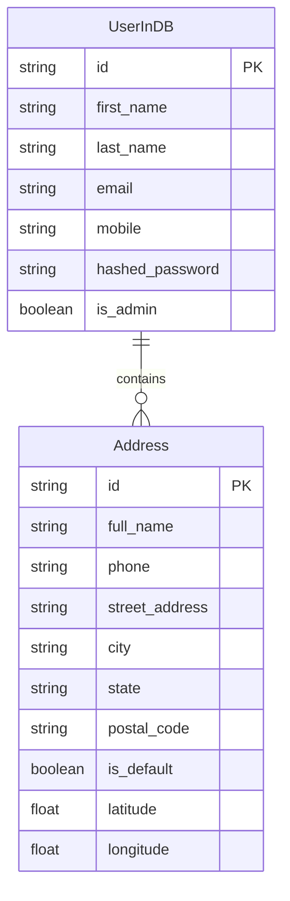
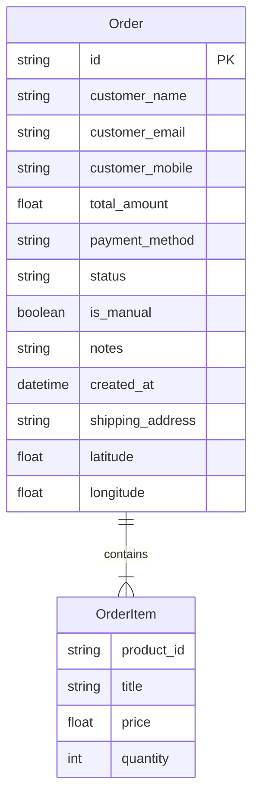
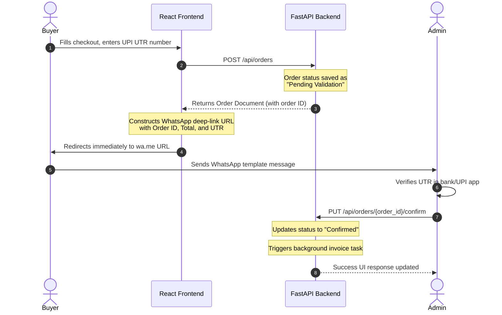
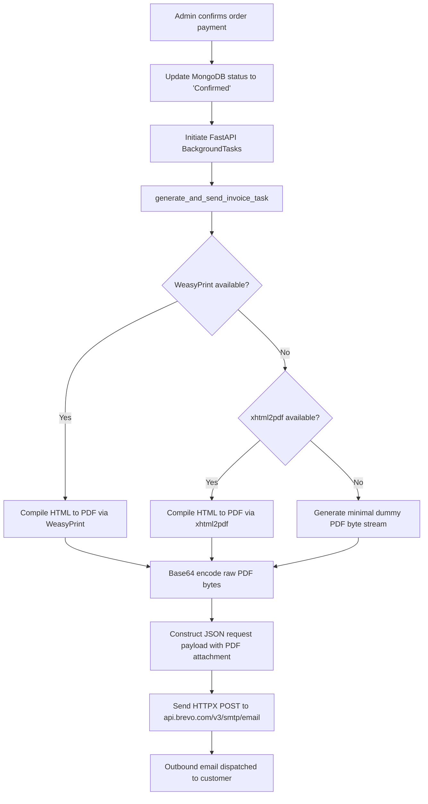
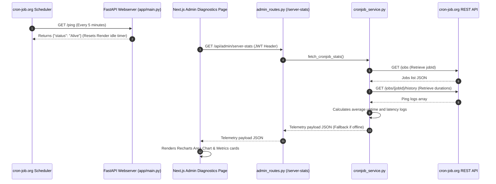

# Project Architecture & Context Blueprint: Crochet Creation

This document provides a comprehensive, highly detailed static analysis and architectural overview of the **Crochet Creation** application, spanning both the FastAPI backend and Next.js frontend, database models, business workflows, third-party integrations, security details, and scaling/operational vulnerabilities.

---

## 1. Tech Stack & Infrastructure

The application consists of a decoupled frontend-backend architecture integrated with a cloud database and multiple external REST APIs.

### Backend Services & Runtimes
| Technology / Library | Version | Purpose |
| :--- | :--- | :--- |
| **FastAPI** | `0.111.0` | Asynchronous web framework for high-performance REST APIs |
| **Uvicorn** | `0.30.1` | ASGI server for running the FastAPI application |
| **Python** | `3.10+` | Execution environment runtime |
| **Motor** | `3.4.0` | Asynchronous MongoDB driver wrapping PyMongo |
| **PyMongo** | `4.7.2` | Core MongoDB client library |
| **Pydantic** | `2.7.2` | Data validation and settings management (using Pydantic v2 core) |
| **Passlib (with Bcrypt)** | `1.7.4` | Password hashing and validation context |
| **PyJWT** | `2.8.0` | JSON Web Token parsing, signing, and verification |
| **HTTPX** | `0.27.0` | Asynchronous HTTP client for outbound integration calls |
| **WeasyPrint** | `62.0` | HTML-to-PDF rendering engine utilizing Cairo and Pango |
| **xhtml2pdf** | `0.2.16` | Pure-Python HTML-to-PDF fallback renderer |

### Frontend Services & Runtimes
| Technology / Library | Version | Purpose |
| :--- | :--- | :--- |
| **Next.js** | `14.2.3` | App Router React framework supporting SSR, SSG, and client routes |
| **React** | `18.3.1` | Interactive components interface framework |
| **Framer Motion** | `12.39.0` | Page transitions and UI micro-animations |
| **Tailwind CSS** | `3.4.4` | CSS styling utility-first framework |
| **Recharts** | `3.9.1` | Interactive system telemetry performance charts |
| **Lucide React** | `0.395.0` | SVG iconography system |
| **Lenis** | `1.3.23` | Smooth scrolling physics layer |
| **Leaflet & React Leaflet**| `1.9.4` / `4.2.1` | Geolocation rendering maps for shipping coordinates |

### Infrastructure & External APIs
*   **Database**: **MongoDB Atlas** (Cloud Database Store) with a local in-memory fallback (`MockDatabase`) to preserve functionality in restricted testing/dev conditions.
*   **Transactional Email API**: **Brevo (formerly Sendinblue) v3 REST API** (`POST https://api.brevo.com/v3/smtp/email`) using HTTPX for all outbound emails, replacing SMTP libraries due to Render port blocks.
*   **Performance Monitoring**: **cron-job.org API** (`Authorization: Bearer <API_KEY>`) to schedule keep-alive ticks and fetch telemetry history.
*   **Media Management**: **Cloudinary API** for uploading and serving catalog product photographs.
*   **Deployment Platforms**:
    *   **FastAPI Backend**: Hosted on **Render** (Free Tier - prone to sleeping when inactive).
    *   **Next.js Frontend**: Hosted on **Vercel** or **Render**.

---

## 2. Directory Structure & Modular Responsibilities

### Overall Directory Layout
```
crochetcreation/
├── Backend/                    # FastAPI Asynchronous Service App
│   ├── app/
│   │   ├── api/                # API Dependency Providers
│   │   ├── core/               # Configuration settings and MongoDB client
│   │   ├── models/             # Pydantic validation schemas
│   │   ├── routes/             # REST resource routers
│   │   ├── utils/              # PDF generation, Brevo client, Cron Service
│   │   └── main.py             # FastAPI startup and CORS configuration
│   ├── requirements.txt        # Python library dependencies
│   └── test_db_conn.py         # MongoDB connection testing script
└── crochetcreation_web/        # Next.js App Router Frontend
    ├── app/
    │   ├── about/              # About the brand pages
    │   ├── admin/              # Admin ERP Dashboard Section
    │   │   ├── customers/      # Customer account list
    │   │   ├── customizer/     # Homepage banner builder
    │   │   ├── dashboard/      # Metrics and recent orders
    │   │   ├── diagnostics/    # Server stats & microservice matrix page
    │   │   ├── orders/         # Order verification & update tables
    │   │   ├── products/       # Products inventory catalog
    │   │   ├── settings/       # Store configurations panel
    │   │   └── layout.tsx      # Sidebar, layout header, theme provider
    │   ├── components/         # Shared frontend UI components
    │   ├── context/            # React Auth context providers
    │   ├── dashboard/          # User personal orders history
    │   ├── globals.css         # Styling system base variables
    │   ├── page.tsx            # Main Landing/Shop Homepage
    │   └── product/            # Individual item detail pages
    ├── tailwind.config.ts      # CSS colors, font family config
    └── package.json            # Node.js dependencies
```

### Module Responsibilities

#### Backend Modules:
1.  **`app/core/config.py`**: Manages environment variables using `python-dotenv`. Pulls credentials for MongoDB Atlas, Cloudinary, JWT parameters, Brevo mail sender details, and cron-job.org keys.
2.  **`app/core/db.py`**: Initializes the database connector. Standard execution connects to a remote MongoDB Atlas database via `AsyncIOMotorClient`. If connectivity fails (e.g., DNS timeout or non-whitelisted IP address), it automatically falls back to an **in-memory `MockDatabase`** seeded with a default administrator, shop product, and placeholder order.
3.  **`app/api/deps.py`**: Provides security and authentication dependencies (`get_current_user` and `get_current_admin_user`) by decoding the Bearer JWT token and querying the MongoDB users collection.
4.  **`app/utils/pdf_generator.py`**: Async in-memory HTML-to-PDF rendering wrapper. Utilizes `WeasyPrint` for modern rendering support. If OS Pango/Cairo dynamic libraries are missing (such as on Render container runtimes), it falls back to `xhtml2pdf`, and finally to a static dummy PDF buffer as a last resort.
5.  **`app/utils/email_sender.py`**: Replaced all SMTP libraries. Dispatches JSON email requests to Brevo's REST API endpoint asynchronously. Embeds raw PDF bytes as base64 attachments under the `attachment` attribute list.
6.  **`app/utils/cronjob_service.py`**: Contacts `cron-job.org` REST API endpoints (`/jobs` and `/jobs/{jobId}/history`) to read telemetry logs, track response latency, and calculate uptime percentages. Returns structured mock data if the API keys are missing or credentials fail.

#### Frontend Modules:
1.  **`app/admin/layout.tsx`**: Renders the administrative sidebar (Dashboard, Customizer, Orders, Products, Customers, Settings, and Diagnostics). Manages auth authorization verification and light/dark mode states.
2.  **`app/admin/diagnostics/page.tsx`**: Renders the System Diagnostics control panel. Communicates with backend endpoints to show Python/FastAPI environment variables, active microservices state metrics, and simulated real-time logs.
3.  **`app/components/ServerPerformanceChart.tsx`**: Interactive dashboard card using `Recharts`. Renders latency history as an `<AreaChart>` and tracks average response speed, active state, and uptime percentage.
4.  **`app/product/[id]/page.tsx`**: Product detail page. Handles ordering, coordinates geolocation coordinates retrieval via browser APIs, and directs UPI checkout requests before triggering the WhatsApp deep link.

---

## 3. Database Schema & Data Models

All models utilize **Pydantic v2** for verification and parsing. BSON ObjectId fields are parsed into strings using `BeforeValidator`.

### User Models (`app/models/user.py`)


*   **`UserBase`**: Shared fields including standard string validations, `EmailStr` formatting, and a phone number validator (`validate_mobile`) that strips whitespace/separators and enforces `^\+?\d{10,15}$`.
*   **`UserResponse`**: Safe data output (excludes hashed passwords) with a nested list of custom addresses.
*   **`UserInDB`**: Extends user fields to store the `hashed_password` string securely.

### Product Models (`app/models/product.py`)
*   **`ProductModel`**: Enforces inventory validations:
    *   `price`: float, strictly greater than zero (`gt=0`).
    *   `sellingPrice`, `originalPrice`: optional floats.
    *   `image_url`: Primary catalog image link.
    *   `image_urls`: List of additional carousel image assets.
    *   `width`, `height`: Integer dimension coordinates.
    *   `in_stock`: Boolean availability flag.

### Settings Models (`app/models/settings.py`)
*   **`SettingsModel`**: Configurable shop options:
    *   `store_name` (default: `"CrochetCreation"`)
    *   `support_email` (default: `"support@crochetcreation.com"`)
    *   `support_phone` (default: `"+91 86375 10045"`)
    *   `currency` (default: `"INR"`)
    *   `enable_cod`: boolean (default: `True`)
    *   `enable_upi`: boolean (default: `True`)
    *   `upi_id`: string (default: `"samiran.samanta@upi"`)
    *   `max_custom_requests_per_day`: integer (default: `5`)
    *   `enable_email_notifications`: boolean (default: `True`)

### Order Models (`app/models/order.py`)


*   **`OrderItem`**: Schema representing line items with price, quantity, and product ID.
*   **`OrderCreate`**: Schema used by customers when placing orders online.
*   **`ManualOrderCreate`**: Schema for administrator-created manual orders (e.g. Instagram/WhatsApp DM sales), making email and phone numbers optional.
*   **`OrderResponse`**: Output schema returned from database queries. Includes the order `status` (default: `"Pending"`) and `created_at` timestamp.

---

## 4. Core Business Workflows

### A. Order Placement & WhatsApp Redirect Workflow
This workflow coordinates UPI payments without a formal payment gateway by utilizing manual validation.



1.  **Frontend Form Submission**: The customer enters their name, email, shipping address, coordinates, and the **UPI UTR transaction reference number** after paying.
2.  **API Registration**: A `POST /api/orders` call registers the order in MongoDB with the status set to `"Pending Validation"`.
3.  **WhatsApp Redirection**: Upon receiving the successful API response, the frontend constructs a WhatsApp message with the order details and redirects the user to:
    `https://wa.me/918637510045?text=Hello%21%20I%20have%20placed%20an%20order...`
4.  **Admin Verification**: The admin verifies the payment using the UTR number in their banking app. They then log into the admin dashboard and click the **Confirm Order** button, sending a request to the backend.

---

### B. Background Invoice & Email Delivery Workflow
PDF generation and email dispatch are executed as background tasks to prevent request timeouts.



1.  **Background Execution**: The `PUT /api/orders/{order_id}/confirm` route registers `generate_and_send_invoice_task` into the `BackgroundTasks` queue.
2.  **In-Memory PDF Compilation**:
    *   Renders a cream-colored HTML/CSS template containing the order details.
    *   Calls the PDF generation engine (`WeasyPrint` or `xhtml2pdf`) to create the PDF in memory (`io.BytesIO`).
3.  **Brevo REST Delivery**:
    *   Encodes the PDF byte stream to base64.
    *   Sends a POST request to the Brevo email API.

---

### C. Server Keep-Alive & Performance Telemetry
This workflow prevents the Render Free Tier container from entering sleep mode due to inactivity.



1.  **Scheduled Ping**: A cron job scheduled on `cron-job.org` sends a GET request to `/ping` every 5 minutes, preventing the Render backend container from sleeping.
2.  **Metrics Gathering**:
    *   The `Diagnostics` page in the Next.js dashboard requests metrics from `/api/admin/server-stats`.
    *   The backend queries the `cron-job.org` API using the key configured in `.env`.
    *   It parses the ping history to compute average uptime and latency.
    *   If the API key is missing or the request fails, the service returns simulated data as a fallback.

---

## 5. Security & Code Standards

### Authentication & Authorization Details
*   **Token Standard**: OAuth2 using Bearer JWT tokens.
*   **Signing Details**: Configured via `settings.SECRET_KEY` and signed with the `HS256` algorithm.
*   **Expiration Duration**: Defined by `ACCESS_TOKEN_EXPIRE_MINUTES` (defaults to 30 minutes).
*   **Dependency Injection Gateways**:
    *   `get_current_user`: Extracts the `sub` claim (user email) from the JWT token and fetches the user from the database.
    *   `get_current_admin_user`: Inherits from `get_current_user` and validates that the `is_admin` flag is set to `True`.

### Password Security & Recovery
*   **Storage**: Passwords are saved as hashes using `passlib.context.CryptContext` with `bcrypt`.
*   **Recovery Flow**:
    1.  The user requests a password reset.
    2.  The backend generates a secure 6-digit OTP and sends it via email.
    3.  The OTP is validated before the user can set a new password.

### CORS & Network Settings
*   **Middleware Config**:
    ```python
    app.add_middleware(
        CORSMiddleware,
        allow_origins=["*"],
        allow_credentials=False,
        allow_methods=["*"],
        allow_headers=["*"],
    )
    ```
    Allows cross-origin requests from any frontend domain, but disables cookies/credentials transfer.

---

## 6. Vulnerabilities, Business Logic Loopholes, and Scaling Concerns

During a static review of the codebase, several design choices were identified that could introduce risks as the application scales.

### 1. In-Memory Mock Database Fallback Risk [RESOLVED]
> [!NOTE]
> **Resolution Status**: Mitigated. Fallback is now disabled in production (when `RENDER` environment variable is detected) and configurable via the `DB_FALLBACK_ENABLED` setting. If a connection fail occurs, the database instance is set to `None`, leading to a safe `503 Service Unavailable` API response instead of losing user data in ephemeral RAM. Mock fallback is allowed strictly in development contexts when explicitly enabled.

### 2. Manual UPI Transaction Validation Loophole
> [!CAUTION]
> **Risk Description**: The application uses manual verification of UPI UTR numbers via WhatsApp messages instead of an integrated payment gateway.
>
> **Potential Impact**:
> *   **Admin Spoofing**: Customers could submit duplicate or fake UTR numbers. The admin must manually verify each transaction in their bank statement, which is prone to errors.
> *   **Race Conditions**: If an order status is marked as "Processing" or "Confirmed" without verifying the UTR, products may be shipped without payment.
> *   **Scalability**: Manual verification becomes a bottleneck as order volume increases.

### 3. Ephemeral Filesystem invoice Generation [RESOLVED]
> [!NOTE]
> **Resolution Status**: Resolved. PDF invoices are generated dynamically on-the-fly from the database-stored order details when the authenticated user (order owner) or admin requests them via `/api/orders/{order_id}/invoice`. This eliminates filesystem writing and external media storage costs (e.g. S3, Cloudinary).

### 4. Permissive CORS Settings
> [!WARNING]
> **Risk Description**: CORS middleware is configured to allow all origins (`allow_origins=["*"]`).
>
> **Potential Impact**: Allows any website to make API requests to the backend. While authentication tokens are required for protected endpoints, open origins increase the attack surface for potential exploits.

### 5. Lack of Transactional Consistency [RESOLVED]
> [!NOTE]
> **Resolution Status**: Mitigated. We have introduced an `email_sent: bool` field to the Order schema and database documents. When an email background task executes (whether for confirmation/invoice or manual orders), it writes the final delivery result (`True`/`False`) back to the database, allowing admins to track delivery status from their dashboard.
